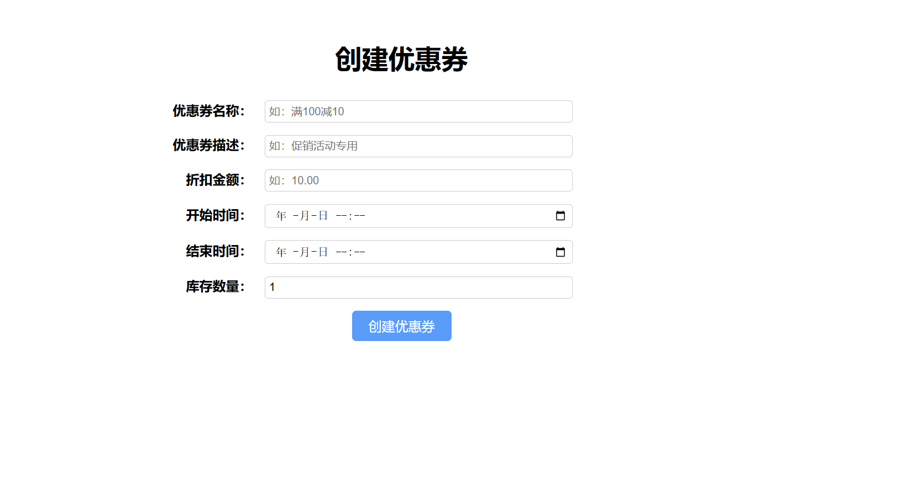
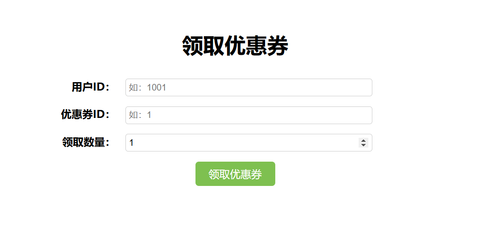

### 基于springboot和rabbitmq+Redisson 实现的 （优惠券/密钥）购买/发放/兑换 场景实现

#### 框架
1.Spring Boot
2.RabbitMQ
3.Redisson
4.mybatis-plus
5.mysql

### 涉及技术：
1.乐观锁：你已经在使用乐观锁来处理库存更新，这是正确的做法。
2.消息队列：使用消息队列来异步处理优惠券发放，可以缓解高并发压力。
3.幂等性：确保消息处理的幂等性，防止重复处理。
4.读写锁：在某些情况下，可以使用读写锁来管理并发访问，但在这个场景中，消息队列已经很好地解决了并发问题。

### 解决方式
方案 1：仅在生产者端加锁 + 数据库乐观锁(购买场景 保证库存实时更新的情况)
在 getCoupon 方法中继续使用 Redisson 分布式锁。
在消费者端不使用分布式锁，而是使用 MyBatis Plus 乐观锁来保证并发一致性。

方案2：仅在消费者端加锁 + 数据库乐观锁(秒杀场景)
在 asyncCoupon接口把索引请求放到消息队列中
在消费者端使用 Redisson 分布式锁来保证并发一致性+ 在消费者端使用 MyBatis Plus 乐观锁来保证并发一致性。

### 测试：
#### 1.启动：Application.java
#### 2.创建优惠券页面：http://localhost:8080/createCoupon.html

#### 3.查询优惠券信息接口：http://localhost:8080/api/coupon/query/2

```json
{
  "name": "消息队列测试100",
  "description": "测试100",
  "discount": 10.00,
  "totalStock": 100,
  "startTime": "2025-01-22T14:17:00.000+00:00",
  "id": 4,
  "endTime": "2025-02-21T14:17:00.000+00:00",
  "remainingStock": 0
}
```
#### 4.领券页面：http://localhost:8080/getCoupon.html



#### 5.并发测试领券接口：http://localhost:8080/api/coupon/asyncCoupon
```json
{
  "userId": 1000,
  "couponId": 4,
  "num": 1  
}
```
使用python模拟并发请求接口文件：src/main/resources/coupon_concurrency_test.py

### 扩展
1.可以扩展为密钥/卡券售卖
2.编写兑换接口兑换使用